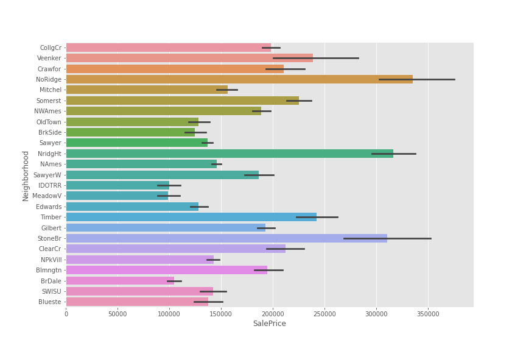

## Introduction

* This notebook explores all the features in determining Sale Price of a house.

* The dataset consists of all the features that help in predicting the sale price of a house.

* The complete description of the data is given in the description.txt file attached along with the data.

* Let's start with the analysis.

## EDA

### new features

